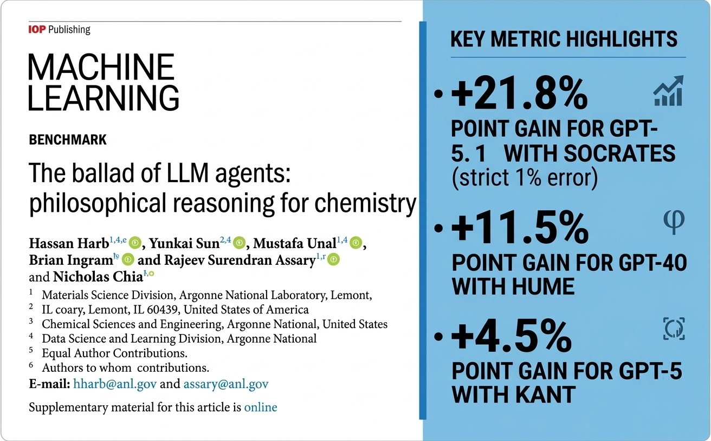
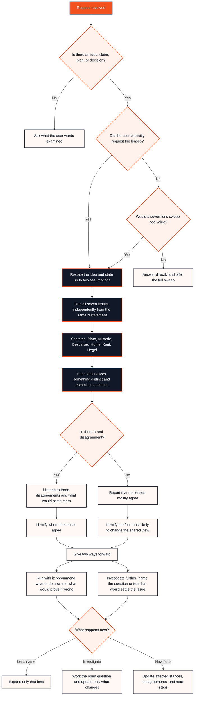
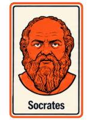
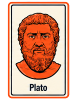
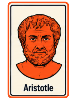
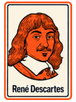
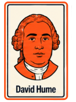
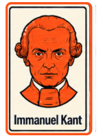
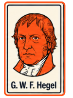

# reasoning-lens

A Claude Skill that runs your idea past seven philosophers' ways of reasoning, one at a time, so you see what each one notices, and where they disagree.

> **Experimental pre-release (0.2.0).** No eval rounds have run yet. See [How It Will Be Tested](#how-it-will-be-tested).

## Why

Ask for "a few perspectives" and you usually get one answer said seven ways. reasoning-lens makes each lens commit to a stance, then lists only the disagreements that come from what each lens actually checks. When the lenses agree, it says so instead of inventing conflict.

The seven reasoning methods come from a published study: Harb et al. (2026), *The ballad of LLM agents: philosophical reasoning for chemistry*. The research boundary matters: the study tested the methods independently on chemistry questions; reasoning-lens extends them into a sequential sweep for general ideas.

## Research Foundation

reasoning-lens takes its starting point from Harb et al. (2026), *The ballad of LLM agents: philosophical reasoning for chemistry*. The study encoded seven philosophy-inspired reasoning methods as fixed system prompts and tested them independently on numerical chemistry questions.

<table>
<tr>
<td width="60%" valign="top">

</td>
<td width="40%" valign="top">

<strong>Philosophical prompting changed model performance.</strong>  

Harb et al. (2026) tested seven philosophy-inspired system prompts on 243 numerical ChemBench questions. Different reasoning methods helped different models and problems; no single philosopher was universally best.  

<code>reasoning-lens</code> starts from those seven reasoning patterns, but asks a different question: <strong>what happens when they are orchestrated as a sequential reasoning system for general problems?</strong>  

<a href="docs/research/harb-et-al-2026-philosophical-reasoning.pdf">Read the paper →</a> 
<a href="https://doi.org/10.1088/2632-2153/ae792d">Publisher / DOI →</a> 
<a href="docs/research-context.md">Research boundary →</a>

</td>
</tr>
</table>

| Harb et al. (2026) | reasoning-lens |
|---|---|
| Chemistry benchmark | General ideas, plans, claims, and decisions |
| Seven philosophy agents tested independently | Seven reasoning lenses run sequentially |
| Numerical-answer accuracy | Disagreement calibration and resolution conditions |
| Tests whether philosophy-inspired prompting changes model performance | Tests whether orchestration adds useful thinking beyond the lens cards |

The distinction is deliberate: published findings are treated as evidence for the individual reasoning patterns, not as proof that this Skill's orchestration works. That claim is tested separately in this repository.

## What It Does

- Restates your idea in one sentence, with any assumptions stated.
- Runs seven lenses in order: Socrates, Plato, Aristotle, Descartes, Hume, Kant, Hegel. Each says what it notices in three sentences or fewer and commits to a stance: **Supports**, **Supports if**, **Challenges**, or **Can't judge yet**.
- Lists one to three real disagreements, each with the fact or value it turns on. Or says "They mostly agree."
- Gives you two ways forward:
  - **Run with it:** what to do now, which side it takes, and the signal that would prove it wrong. Usable without replying.
  - **Investigate further:** the one question or test that would settle the biggest disagreement.
- Skips the sweep for rewrites, lookups, definitions, code, and one-answer problems. It answers directly and offers the sweep anyway.

## How It Works

reasoning-lens keeps the seven methods independent during the sweep, then compares their committed stances to find genuine disagreement and a useful next step.

## The Lenses

The seven lenses are not biographies or simulated personalities. Each translates a philosophy-inspired reasoning pattern into a concrete system behavior, and each runs independently against the same restated idea before the Skill compares their committed stances.

<table>
<tr>
<td width="40%" align="center" valign="middle">

</td>
<td width="60%" valign="middle">
<strong>Socrates · Assumption Gate</strong>  
Clarifies the object of reasoning before the system reasons about it: defining ambiguous terms, surfacing hidden assumptions, and testing whether the stated claim survives basic cross-examination. <strong>In the Skill:</strong> this protects the seven-lens sweep from confidently analyzing the wrong problem and gives every later lens the same explicit claim to examine.
</td>
</tr>
<tr>
<td width="40%" align="center" valign="middle">

</td>
<td width="60%" valign="middle">
<strong>Plato · Pattern Lift</strong>  
Moves upward from the visible case to the structure beneath it: distinguishing the metric, label, or local symptom from the larger pattern it may represent. <strong>In the Skill:</strong> this prevents the sweep from treating the user's current framing as the only possible representation of the problem.
</td>
</tr>
<tr>
<td width="40%" align="center" valign="middle">

</td>
<td width="60%" valign="middle">
<strong>Aristotle · Causal Map</strong>  
Classifies the thing being examined and separates the different kinds of explanation operating inside it: what it is, what drives it, what it is for, and which premises connect cause to conclusion. <strong>In the Skill:</strong> this exposes category errors, missing premises, and plans that confuse a means with the intended end.
</td>
</tr>
<tr>
<td width="40%" align="center" valign="middle">

</td>
<td width="60%" valign="middle">
<strong>Descartes · Dependency Audit</strong>  
Decomposes the claim or plan into smaller dependencies and rebuilds it from the most reliable parts outward: testing whether each step is clear, established, and logically connected. <strong>In the Skill:</strong> this finds weak premises, broken sequences, and conclusions that cannot be reconstructed from what the user actually knows.
</td>
</tr>
<tr>
<td width="40%" align="center" valign="middle">

</td>
<td width="60%" valign="middle">
<strong>Hume · Evidence Calibration</strong>  
Separates observation from inference and calibrates confidence to the evidence available, especially where correlation, extrapolation, or causal claims outrun what has actually been observed. <strong>In the Skill:</strong> this gives evidential claims a confidence boundary and identifies the specific evidence that would justify stronger belief.
</td>
</tr>
<tr>
<td width="40%" align="center" valign="middle">

</td>
<td width="60%" valign="middle">
<strong>Kant · Boundary Check</strong>  
Examines the conditions that make the claim meaningful or valid in the first place, then marks where those conditions stop holding. <strong>In the Skill:</strong> this surfaces hidden preconditions, framework-dependent conclusions, and claims whose apparent certainty extends beyond their legitimate scope.
</td>
</tr>
<tr>
<td width="40%" align="center" valign="middle">

</td>
<td width="60%" valign="middle">
<strong>Hegel · Contradiction Reframe</strong>  
Finds where an idea undermines one of its own commitments and asks whether the opposing pressure contains something that must be preserved. <strong>In the Skill:</strong> this turns genuine internal tension into a stronger formulation when synthesis is possible—and leaves it as a real choice when it is not.
</td>
</tr>
</table>

> **These are reasoning operations, not simulated personalities.** Each lens runs independently against the same restated idea before the Skill compares their committed stances.

## Sample Output

See [`reasoning-lens/examples/ai-training-gate.md`](reasoning-lens/examples/ai-training-gate.md): should an org require a four-hour AI course before granting Copilot access? This is a development run written to show the format, not eval evidence.

## Install

The Skill lives in the `reasoning-lens/` folder of this repo. Install that folder, not the whole repo.

### claude.ai

1. Clone this repo.
2. From the repo root, zip the Skill folder: `zip -r reasoning-lens.zip reasoning-lens`
3. In claude.ai, turn on code execution in Settings.
4. Go to **Customize > Skills**, click **+**, choose **Create skill**, then **Upload a skill**. Upload `reasoning-lens.zip`.
5. Ask: "Run the lenses on this: ..."

Uploaded Skills apply to your account, not to a single Project.

### Claude Code (personal)

1. Clone this repo.
2. Copy the `reasoning-lens/` folder into `~/.claude/skills/`.
3. Restart Claude Code.
4. Ask: "Run the lenses on this: ..."

### Claude Code (project)

1. Clone this repo.
2. Copy the `reasoning-lens/` folder into `.claude/skills/` in your project repo.
3. Restart Claude Code.
4. Ask: "Run the lenses on this: ..."

## Requirements

- **Claude access** with Skills support: claude.ai with code execution on, or Claude Code.
- **An idea to examine:** a plan, claim, proposal, or decision, with some background.
- **No dependencies.** The Skill is Markdown only. The `evals/` folder holds a maintainer-only checker that is not part of the install.

## Try First

Run the lenses on this: we should replace our annual performance reviews with quarterly check-ins.

Background: 400 employees. Managers say the annual review takes too long; we have no data on whether it changes performance.

## How It Will Be Tested

Before 1.0.0, the Skill must pass a pre-registered evaluation, [`evals/PROTOCOL.md`](evals/PROTOCOL.md). The method and thresholds were fixed before any output was generated.

The key test is whether the Skill's structure earns its place. The full Skill is compared with Claude given the same seven lens cards but none of the orchestration (no committed stances, no disagreement test, no two ways forward). Plain Claude and Claude given only the philosophers' names complete the comparison, to show whether the value comes from the names, the cards, or the structure. Judges from a different model family score the outputs blind on two things:

1. **Disagreement calibration:** does it find the disagreements that matter, and avoid inventing them when the idea is sound?
2. **Resolution condition:** does it name the fact, value, or test that would settle the main uncertainty?

Length is measured, not judged, and the Skill fails the bar if it wins only by saying more. All runs, scores, and caveats will be in [`evals/`](evals/), including rounds that lose. Until then, treat the Skill as an experiment.

## Evidence

| Claim | Class |
|---|---|
| Individual philosophy-inspired prompts changed accuracy on numerical chemistry questions, and no single prompt was best everywhere. | Published finding (Harb et al., 2026) |
| The lens cards capture those prompts' reasoning moves outside chemistry. | This project's interpretation |
| Running all seven in sequence, and showing where they disagree, helps you think about an idea. | This project's hypothesis, untested |

Details: [`docs/research-context.md`](docs/research-context.md).

## When Not To Use

- You want one quick answer, not seven angles.
- The task is a rewrite, a lookup, or code.
- You need a ranked list of options and a first step. Use [problem-lens](https://github.com/davehallmon/problem-lens) for that.

## What It Can't See

The seven methods examine how an idea reasons. They do not weigh who gains or loses, what people feel, or facts you did not give. A sound argument can still be wrong for the people it affects. Treat the sweep as one view, not a verdict.

## The Family

reasoning-lens is part of [OCCAMI NOVACULA](https://github.com/davehallmon), a growing suite of Skills. Two are published:

| Skill | Question | Shape |
|---|---|---|
| [problem-lens](https://github.com/davehallmon/problem-lens) | What should I do? | Twelve lenses, six ranked moves, one first step |
| reasoning-lens | How should I think about this? | Seven methods, one idea, the disagreements |

## Credits

The seven reasoning methods are summarized from the system prompts published by Hassan Harb, Yunkai Sun, Mustafa Unal, Nicholas Chia, Zhenzhen Yang, Brian Ingram, and Rajeev Surendran Assary with *The ballad of LLM agents: philosophical reasoning for chemistry*, Mach. Learn.: Sci. Technol. 7, 030503 (2026), DOI [10.1088/2632-2153/ae792d](https://doi.org/10.1088/2632-2153/ae792d). Original prompts: [HassanHarb92/Sci_reasoning_LLMs](https://github.com/HassanHarb92/Sci_reasoning_LLMs).

This project is independent and not endorsed by the authors. The original prompts are not redistributed here. See [`NOTICE.md`](NOTICE.md).

## Contributing

See `CONTRIBUTING.md`. Design spec: [`docs/DESIGN.md`](docs/DESIGN.md).

## License

MIT for the original work in this repo. See `LICENSE` and `NOTICE.md`.

