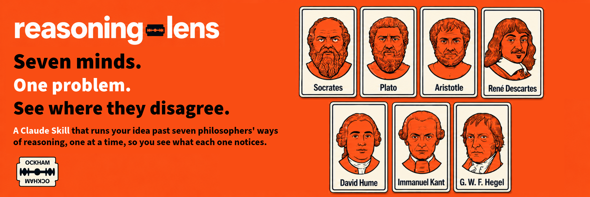

# reasoning-lens

A Claude Skill that runs your idea past seven philosophers' ways of reasoning, one at a time, so you see what each one notices.

## Get It

[github.com/davehallmon/reasoning-lens](https://github.com/davehallmon/reasoning-lens)

## What It Does

- Seven minds. One problem. See where they disagree.
- Each lens commits to a stance.
- Real disagreements only, or "They mostly agree."
- Two ways forward: Run with it, or Investigate further.

## Status

Pre-release. Not yet evaluated.

## The Family

reasoning-lens covers *how to think*. Its sibling, [problem-lens](https://github.com/davehallmon/problem-lens), covers *what to do*: twelve lenses, six moves, one first step.

## Install

See the [README](https://github.com/davehallmon/reasoning-lens#install).

## License

MIT.
